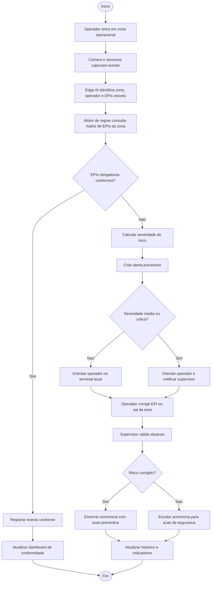

# Diagrama de Atividades - Emissao de Alerta de Risco

```mermaid
flowchart TD
    A([Inicio]) --> B[Operador entra em zona operacional]
    B --> C[Camera e sensores capturam evento]
    C --> D[Edge AI identifica zona, operador e EPIs visiveis]
    D --> E[Motor de regras consulta matriz de EPIs da zona]
    E --> F{EPIs obrigatorios conformes?}
    F -- Sim --> G[Registrar evento conforme]
    G --> H[Atualizar dashboard de conformidade]
    H --> Z([Fim])

    F -- Nao --> I[Calcular severidade do risco]
    I --> J[Criar alerta preventivo]
    J --> K{Severidade media ou critica?}
    K -- Nao --> L[Orientar operador no terminal local]
    K -- Sim --> M[Orientar operador e notificar supervisor]
    L --> N[Operador corrige EPI ou sai da area]
    M --> N
    N --> O[Supervisor valida situacao]
    O --> P{Risco corrigido?}
    P -- Sim --> Q[Encerrar ocorrencia com acao preventiva]
    P -- Nao --> R[Escalar ocorrencia para acao de seguranca]
    Q --> S[Atualizar historico e indicadores]
    R --> S
    S --> Z
```

