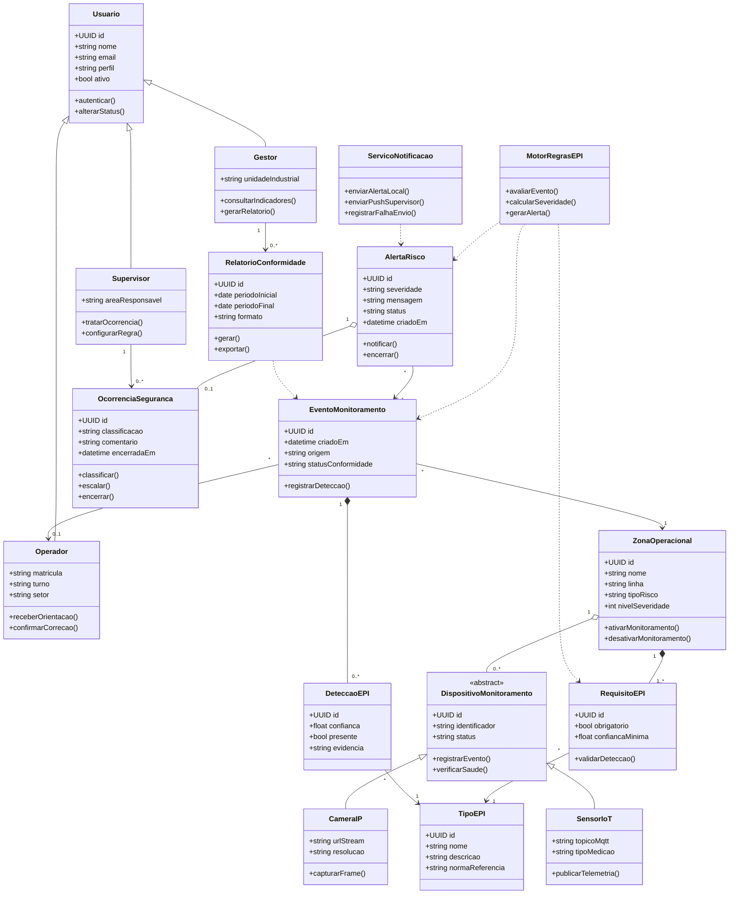

# Diagrama de Classes

```mermaid
classDiagram
    class Usuario {
        +UUID id
        +string nome
        +string email
        +string perfil
        +bool ativo
        +autenticar()
        +alterarStatus()
    }

    class Operador {
        +string matricula
        +string turno
        +string setor
        +receberOrientacao()
        +confirmarCorrecao()
    }

    class Supervisor {
        +string areaResponsavel
        +tratarOcorrencia()
        +configurarRegra()
    }

    class Gestor {
        +string unidadeIndustrial
        +consultarIndicadores()
        +gerarRelatorio()
    }

    class ZonaOperacional {
        +UUID id
        +string nome
        +string linha
        +string tipoRisco
        +int nivelSeveridade
        +ativarMonitoramento()
        +desativarMonitoramento()
    }

    class RequisitoEPI {
        +UUID id
        +bool obrigatorio
        +float confiancaMinima
        +validarDeteccao()
    }

    class TipoEPI {
        +UUID id
        +string nome
        +string descricao
        +string normaReferencia
    }

    class DispositivoMonitoramento {
        <<abstract>>
        +UUID id
        +string identificador
        +string status
        +registrarEvento()
        +verificarSaude()
    }

    class CameraIP {
        +string urlStream
        +string resolucao
        +capturarFrame()
    }

    class SensorIoT {
        +string topicoMqtt
        +string tipoMedicao
        +publicarTelemetria()
    }

    class EventoMonitoramento {
        +UUID id
        +datetime criadoEm
        +string origem
        +string statusConformidade
        +registrarDeteccao()
    }

    class DeteccaoEPI {
        +UUID id
        +float confianca
        +bool presente
        +string evidencia
    }

    class MotorRegrasEPI {
        +avaliarEvento()
        +calcularSeveridade()
        +gerarAlerta()
    }

    class AlertaRisco {
        +UUID id
        +string severidade
        +string mensagem
        +string status
        +datetime criadoEm
        +notificar()
        +encerrar()
    }

    class OcorrenciaSeguranca {
        +UUID id
        +string classificacao
        +string comentario
        +datetime encerradaEm
        +classificar()
        +escalar()
        +encerrar()
    }

    class RelatorioConformidade {
        +UUID id
        +date periodoInicial
        +date periodoFinal
        +string formato
        +gerar()
        +exportar()
    }

    class ServicoNotificacao {
        +enviarAlertaLocal()
        +enviarPushSupervisor()
        +registrarFalhaEnvio()
    }

    Usuario <|-- Operador
    Usuario <|-- Supervisor
    Usuario <|-- Gestor
    DispositivoMonitoramento <|-- CameraIP
    DispositivoMonitoramento <|-- SensorIoT

    ZonaOperacional "1" *-- "1..*" RequisitoEPI
    RequisitoEPI "*" --> "1" TipoEPI
    ZonaOperacional "1" o-- "0..*" DispositivoMonitoramento
    EventoMonitoramento "*" --> "1" ZonaOperacional
    EventoMonitoramento "*" --> "0..1" Operador
    EventoMonitoramento "1" *-- "0..*" DeteccaoEPI
    DeteccaoEPI "*" --> "1" TipoEPI
    MotorRegrasEPI ..> EventoMonitoramento
    MotorRegrasEPI ..> RequisitoEPI
    MotorRegrasEPI ..> AlertaRisco
    AlertaRisco "*" --> "1" EventoMonitoramento
    AlertaRisco "1" o-- "0..1" OcorrenciaSeguranca
    Supervisor "1" --> "0..*" OcorrenciaSeguranca
    Gestor "1" --> "0..*" RelatorioConformidade
    RelatorioConformidade ..> EventoMonitoramento
    ServicoNotificacao ..> AlertaRisco
```

